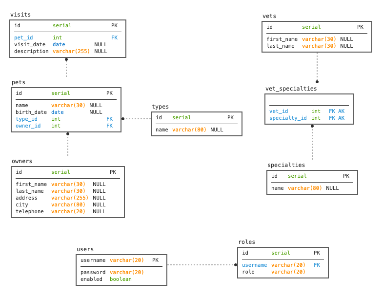

# REST version of Spring PetClinic Sample Application (spring-framework-petclinic extend ) [](https://travis-ci.org/spring-petclinic/spring-petclinic-rest/)

This backend version of the Spring Petclinic application only provides a REST API. **There is no UI**.
The [spring-petclinic-angular project](https://github.com/spring-petclinic/spring-petclinic-angular) is a Angular front-end application which consumes the REST API.

## Understanding the Spring Petclinic application with a few diagrams

[See the presentation of the Spring Petclinic Framework version](http://fr.slideshare.net/AntoineRey/spring-framework-petclinic-sample-application)

### Petclinic ER Model



## Running petclinic locally

### With maven command line
```
git clone https://github.com/spring-petclinic/spring-petclinic-rest.git
cd spring-petclinic-rest
./mvnw spring-boot:run
```

### With Docker
```
docker run -p 9966:9966 springcommunity/spring-petclinic-rest
```

You can then access petclinic here: [http://localhost:9966/petclinic/](http://localhost:9966/petclinic/)

## Swagger REST API documentation presented here (after application start):
[http://localhost:9966/petclinic/swagger-ui.html](http://localhost:9966/petclinic/swagger-ui.html)

## Screenshot of the Angular client


## In case you find a bug/suggested improvement for Spring Petclinic
Our issue tracker is available here: https://github.com/spring-petclinic/spring-petclinic-rest/issues


## Database configuration

In its default configuration, Petclinic uses an in-memory database (HSQLDB) which
gets populated at startup with data.
A similar setups is provided for MySql and PostgreSQL in case a persistent database configuration is needed.
To run petclinic locally using persistent database, it is needed to change profile defined in application.properties file.

For MySQL database, it is needed to change param "hsqldb" to "mysql" in string
```
spring.profiles.active=hsqldb,spring-data-jpa
```
 defined in application.properties file.

Before do this, would be good to check properties defined in application-mysql.properties file.

```
spring.datasource.url = jdbc:mysql://localhost:3306/petclinic?useUnicode=true
spring.datasource.username=pc
spring.datasource.password=petclinic 
spring.datasource.driver-class-name=com.mysql.jdbc.Driver 
spring.jpa.database=MYSQL
spring.jpa.database-platform=org.hibernate.dialect.MySQLDialect
spring.jpa.hibernate.ddl-auto=none
```      

You may also start a MySql database with docker:

```
docker run --name mysql-petclinic -e MYSQL_ROOT_PASSWORD=petclinic -e MYSQL_DATABASE=petclinic -p 3306:3306 mysql:5.7.8
```

For PostgeSQL database, it is needed to change param "hsqldb" to "postgresql" in string
```
spring.profiles.active=hsqldb,spring-data-jpa
```
 defined in application.properties file.

Before do this, would be good to check properties defined in application-postgresql.properties file.

```
spring.datasource.url=jdbc:postgresql://localhost:5432/petclinic
spring.datasource.username=postgres
spring.datasource.password=petclinic
spring.datasource.driver-class-name=org.postgresql.Driver
spring.jpa.database=POSTGRESQL
spring.jpa.database-platform=org.hibernate.dialect.PostgreSQLDialect
spring.jpa.hibernate.ddl-auto=none
```
You may also start a Postgres database with docker:

```
docker run --name postgres-petclinic -e POSTGRES_PASSWORD=petclinic -e POSTGRES_DB=petclinic -p 5432:5432 -d postgres:9.6.0
```

## Security configuration
In its default configuration, Petclinic doesn't have authentication and authorization enabled.

### Basic Authentication
In order to use the basic authentication functionality, turn in on from the application.properties file
```
petclinic.security.enable=true
```
This will secure all APIs and in order to access them, basic authentication is required.
Apart from authentication, APIs also require authorization. This is done via roles that a user can have.
The existing roles are listed below with the corresponding permissions 
* OWNER_ADMIN -> OwnerController, PetController, PetTypeController (getAllPetTypes and getPetType), VisitController
* VET_ADMIN   -> PetTypeController, SpecialityController, VetController
* ADMIN       -> UserController

There is an existing user with the username `admin` and password `admin` that has access to all APIs.
 In order to add a new user, please use the following API:
```
POST /api/users
{
    "username": "secondAdmin",
    "password": "password",
    "enabled": true,
    "roles": [
    	{ "name" : "OWNER_ADMIN" }
	]
}
```

## Working with Petclinic in Eclipse/STS

### prerequisites
The following items should be installed in your system:
* Maven 3 (https://maven.apache.org/install.html)
* git command line tool (https://help.github.com/articles/set-up-git)
* Eclipse with the m2e plugin (m2e is installed by default when using the STS (http://www.springsource.org/sts) distribution of Eclipse)

Note: when m2e is available, there is an m2 icon in Help -> About dialog.
If m2e is not there, just follow the install process here: http://eclipse.org/m2e/download/


### Steps:

1) In the command line
```
git clone https://github.com/spring-petclinic/spring-petclinic-rest.git
```
2) Inside Eclipse
```
File -> Import -> Maven -> Existing Maven project
```


## Looking for something in particular?

| Layer | Source |
|--|--|
| REST API controllers | [REST folder](src/main/java/org/springframework/samples/petclinic/rest) |
| Service | [ClinicServiceImpl.java](src/main/java/org/springframework/samples/petclinic/service/ClinicServiceImpl.java) |
| JDBC | [jdbc folder](src/main/java/org/springframework/samples/petclinic/repository/jdbc) |
| JPA | [jpa folder](src/main/java/org/springframework/samples/petclinic/repository/jpa) |
| Spring Data JPA | [springdatajpa folder](src/main/java/org/springframework/samples/petclinic/repository/springdatajpa) |
| Tests | [AbstractClinicServiceTests.java](src/test/java/org/springframework/samples/petclinic/service/AbstractClinicServiceTests.java) |


## Publishing a Docker image

This application uses [Google Jib]([https://github.com/GoogleContainerTools/jib) to build an optimized Docker image
into the [Docker Hub](https://cloud.docker.com/u/springcommunity/repository/docker/springcommunity/spring-petclinic-rest/)
repository.
The [pom.xml](pom.xml) has been configured to publish the image with a the `springcommunity/spring-petclinic-rest`image name.

## Interesting Spring Petclinic forks

The Spring Petclinic master branch in the main [spring-projects](https://github.com/spring-projects/spring-petclinic)
GitHub org is the "canonical" implementation, currently based on Spring Boot and Thymeleaf.

This [spring-petclinic-rest](https://github.com/spring-petclinic/spring-petclinic-rest/) project is one of the [several forks](https://spring-petclinic.github.io/docs/forks.html) 
hosted in a special GitHub org: [spring-petclinic](https://github.com/spring-petclinic).
If you have a special interest in a different technology stack
that could be used to implement the Pet Clinic then please join the community there.


# Contributing

The [issue tracker](https://github.com/spring-petclinic/spring-petclinic-rest/issues) is the preferred channel for bug reports, features requests and submitting pull requests.

For pull requests, editor preferences are available in the [editor config](https://github.com/spring-petclinic/spring-petclinic-rest/blob/master/.editorconfig) for easy use in common text editors. Read more and download plugins at <http://editorconfig.org>.


